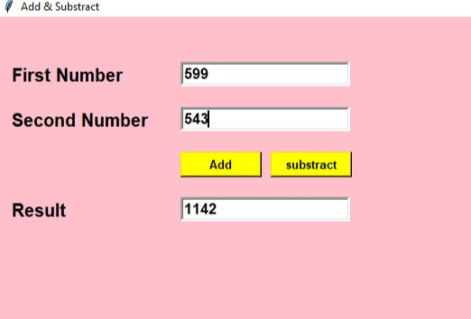

                                    Add & Substarct
                            
This is a tkinter based python project which shows two outputs.
User can provide two integer input and two buttons are provided one for add and another for substract.

My github profile id: haripriya9647

