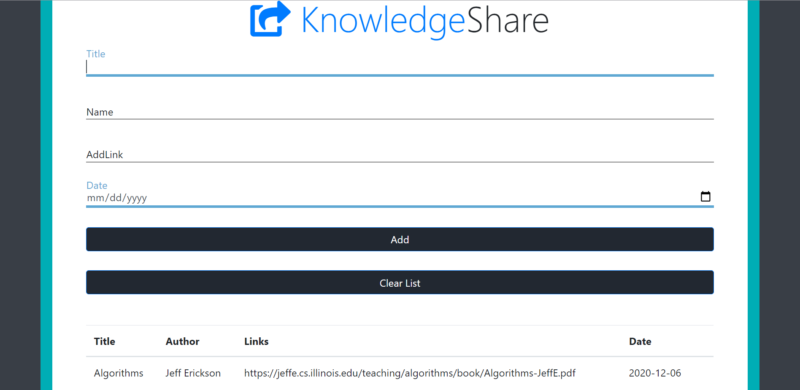

### Knowledge Share
* Knowledge share is a website where you can add resources related to programming and other competitive exams

                   

     
  
## Open Source Contests

### KHARAGPUR WINTER OF CODE (KWOC'20)

 
### Languages used
HTML
JS
CSS
### 

#### This is a beginner friendly project

### Learning Resources:
* Github
* [Link](https://www.udacity.com/course/version-control-with-git--ud123)
* https://guides.github.com/
* HTML CSS Java Script-Youtube or Google
### For doubts and Communication use discord
[Link](https://discord.gg/TKz4ZqpDEZ)
### Contribution Guide
* Fork this repo

* Clone the above repository 

>https://github.com/{your user name}/KnowledgeShare.git

* Now in your local machine  go to the project directory

* Do modifications in your code

### Commands to push your commits
> git status

> git add .

> git commit -m "message"

* Add a descriptive commit message

* To check about commit messages follow the below link

> [link](https://www.freecodecamp.org/news/writing-good-commit-messages-a-practical-guide/)

* Create a branch which has a descriptive name that explains the issue it solves

> git push origin {branch name}

* Now using UI, create a pull request and add issue no it solves in the description.

* To be updated with main branch commits you need to create a  upstream

> git remote add upstream https://github.com/tejaswini22199/KnowledgeShare.git

> git pull upstream

 <strong> Do Star this Repository :star2:</strong>

 
  
 
 Dark Mode ON:
    

    
  

   
  

    
  

  

  

Dark Mode OFF:
  

    
  

   
  

    
  

  

   
  

  <b>Display Forks, Contributors and Stars.</b>
  

    
  

  

